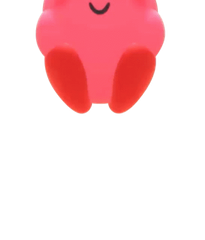

# hi! i'm michael 👋

about me:
- incoming 1st year @ [UWaterloo](https://uwaterloo.ca) computer science
- published a [NeurIPS 2025 workshop paper](https://arxiv.org/abs/2512.18934) on quantization × continual learning
- interested in mechanistic interpretability, AI safety, continual learning and efficiency
- i like hackathons, building games, and kirby!!

previously i've:
- built Roblox games with 1M+ total visits
- won an award @ [JamHacks 2026](https://jamhacks.ca/)
- interned @ [RBC](https://www.rbc.com/), working on databases

I'd love to connect, feel free to reach out!

[linkedin](https://www.linkedin.com/in/michaelshihongzhang/) - [x](https://x.com/michaelshzhang) - [mzhang3518@gmail.com](mailto:mzhang3518@gmail.com)
